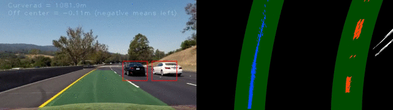

##Vehicle Detection Project##
![alt text][image0]
---
Highlights of the project are the following:

* Continuation of project [Advanced Lane Lines] detection 
* Perform a Histogram of Oriented Gradients (HOG) feature extraction on a labeled training set of images and train a classifier Linear SVM classifier
* Apply a color transform and append binned color features, as well as histograms of color, to HOG feature vector. 
* Implement a sliding-window technique and use the trained classifier to search for vehicles in images.
* Run implementation pipeline on a video stream and create a heat map of recurring detections frame by frame to reject outliers and follow detected vehicles.
* Estimate a bounding box for vehicles detected.

[//]: # (Image References)
[image0]: ./output_images/lane_car_detection.gif
[image1]: ./output_images/car_not_car.png
[image2]: ./output_images/HOG_example.png
[image3]: ./output_images/sliding_windows.jpg
[image4]: ./output_images/sliding_window.png
[image5]: ./output_images/bboxes_and_heat.png
[Advanced Lane Lines]: https://github.com/jinchenglee/CarND-Advanced-Lane-Lines 

## Details
---

###Histogram of Oriented Gradients (HOG)

####1. HOG features extraction from the training images.

The code for this step is contained in files bbox.py, as a class function call get_hog_feature().

```python
    def get_hog_features(self, img, orient, pix_per_cell, cell_per_block,
                            vis=False, feature_vec=True):
        """
        # HoG feature extraction.
        # Call with two outputs if vis==True
        """
        if vis == True:
            features, hog_image = hog(img, orientations=orient,
                                      pixels_per_cell=(pix_per_cell, pix_per_cell),
                                      cells_per_block=(cell_per_block, cell_per_block),
                                      transform_sqrt=False,
                                      visualise=vis, feature_vector=feature_vec)
            return features, hog_image
        # Otherwise call with one output
        else:
            features = hog(img, orientations=orient,
                           pixels_per_cell=(pix_per_cell, pix_per_cell),
                           cells_per_block=(cell_per_block, cell_per_block),
                           transform_sqrt=False,
                           visualise=vis, feature_vector=feature_vec)
            return features

```

All the `vehicle` and `non-vehicle` images from the labelled dataset are read in train_svm() function.  Here is an example of one of each of the `vehicle` and `non-vehicle` classes:

![alt text][image1]

```python
    def train_svm(self):
        """
        Training linear SVM classifier
        """
        # Read in car and non-car images
        image = []
        cars = []
        notcars = []

        for d in ['GTI_Far','GTI_Left','GTI_MiddleClose','GTI_Right','KITTI_extracted']:
            images = glob.glob('vehicles/'+d+'/*.png')
            for f in images:
                cars.append(f)

        for d in ['Extras','GTI']:
            images = glob.glob('non-vehicles/'+d+'/*.png')
            for f in images:
                notcars.append(f)
        ...

```

I then explored different color spaces and different `skimage.hog()` parameters (`orientations`, `pixels_per_cell`, and `cells_per_block`).  I grabbed random images from each of the two classes and displayed them to get a feel for what the `skimage.hog()` output looks like.

Here is an example using the `YCrCb` color space and HOG parameters of `orientations=8`, `pixels_per_cell=(8, 8)` and `cells_per_block=(2, 2)`:


![alt text][image2]


####2. Settled on final choice of HOG parameters.

I tried various combinations of parameters and it turns out colorspace 'YCrCb' with only luminance channel 'Y' fed into hog detection gives best result in the meantime smallest feature width, which saves training and running time. 

The 'CrCb' channels provide little extra differentiation in HOG detection. Instead, I used color information to extract color histogram and binning information to be attached to HOG features extracted from Y/luminance channel.

All the parameters are easily changable as they are implemented as bbox class variables initialized in __init__() function. 

The tuning showed my choices of parameters ended up with pretty high accuracy (98%) on test datasets. 
```
Using spatial binning of: 16 and 10 histogram bins
Number of training data: 14208 testing data: 3552
Feature vector length: 2562
5.45 Seconds to train SVC...
Test Accuracy of SVC =  0.98
My SVC predicts:  [ 0.  0.  0.  1.  1.  0.  1.  0.  0.  1.]
For these 10 labels:  [ 0.  0.  0.  1.  1.  0.  1.  0.  0.  1.]
0.00142 Seconds to predict 10 labels with SVC
```

Below are functions defined in bbox.py class.

```python
    # Class functions
    ...
     def __init__(self):
        # Parameters of image spatial and color histogram features 
        self.spatial_size = 16
        self.histbin = 10
        self.hist_range = (50,256)
        # Parameters of HOG features 
        self.colorspace = 'RGB2YCrCb' # Can be RGB, HSV, LUV, HLS, YUV, YCrCb
        self.orient = 9
        self.pix_per_cell = 8
        self.cell_per_block = 2
	...
    def bin_spatial(self, img, size=(32, 32)):
        """
        # Define a function to compute binned color features  
        """
        # Use cv2.resize().ravel() to create the feature vector
        features = cv2.resize(img, size).ravel()
        # Return the feature vector
        return features

    def color_hist(self, img, nbins=32, bins_range=(0, 256)):
        """
        # Define a function to compute color histogram features  
        """
        # Compute the histogram of the color channels separately
        channel1_hist = np.histogram(img[:,:,0], bins=nbins, range=bins_range)
        channel2_hist = np.histogram(img[:,:,1], bins=nbins, range=bins_range)
        channel3_hist = np.histogram(img[:,:,2], bins=nbins, range=bins_range)
        # Concatenate the histograms into a single feature vector
        hist_features = np.concatenate((channel1_hist[0], channel2_hist[0], channel3_hist[0]))
        # Return the individual histograms, bin_centers and feature vector
        return hist_features
        
    def extract_features(self, imgs):
        """
        # Define a function to extract features from a list of images
        # Have this function call bin_spatial(), color_hist() and get_hog_features().
        """
        # Create a list to append feature vectors to
        features = []
        # Iterate through the list of images
        for file in imgs:
            # Read in each one by one
            image = cv2.imread(file)
            
            # apply color conversion 
            feature_image = img_filter.convert_color(image, conv=self.colorspace)
            # Apply bin_spatial() to get spatial color features
            spatial_features = self.bin_spatial(feature_image, size=(self.spatial_size,self.spatial_size))

            # Apply color_hist() also with a color space option now
            hist_features = self.color_hist(feature_image, nbins=self.histbin, bins_range=self.hist_range)

            # Compute only Y/luminance channel HOG features for the entire image
            hog1 = self.get_hog_features(feature_image[:,:,0], self.orient, self.pix_per_cell, self.cell_per_block, feature_vec=False)

            #hog_features = np.hstack((hog1, hog2, hog3)).reshape(-1,)
            hog_features = hog1.reshape(-1,)
            #print(hog_features.shape)

            # Append the new feature vector to the features list
            features.append(np.concatenate((spatial_features, hist_features, hog_features)))
            
        # Return list of feature vectors
        return features
    ...

```

####3. Train a classifier using selected HOG features and color features

I trained a linear SVM using skimage.svm library. 

Feature concatenation was discussed in last section. Before feeding concatenated features into training, I've normalize the values per feature column by using sklearn.preprocessing.StandardScaler thus not a single feature can override others due to its absolute values. 

A following up step is to randomize the samples by using sklearn.model_selection.train_test_split() to avoid overfitting in trained model. 

```python
	...
        # Extract features from labeled dataset
        car_features = self.extract_features(cars)
        notcar_features = self.extract_features(notcars)
        # Create an array stack of feature vectors
        X = np.vstack((car_features, notcar_features)).astype(np.float64)
        # Fit a per-column scaler
        X_scaler = StandardScaler().fit(X)
        # Apply the scaler to X
        scaled_X = X_scaler.transform(X)

        # Define the labels vector
        y = np.hstack((np.ones(len(car_features)), np.zeros(len(notcar_features))))

        # Split up data into randomized training and test sets
        rand_state = np.random.randint(0, 100)
        X_train, X_test, y_train, y_test = train_test_split(
            scaled_X, y, test_size=0.2, random_state=rand_state)

        # Use a linear SVC 
        svc = LinearSVC()
        # Check the training time for the SVC
        svc.fit(X_train, y_train)
```

###Sliding Window Search

####1. Implementation of a sliding window search.  Scales to search and overlapped windows

The vehicle detection pipeline can be found in function bbox_pipeline() in video.py. 

I decided to search at three different scales: 1.0, 1.5 and 2.0. The bigger scale value covers closer/bigger image patch of input frame while smaller scale covers farther/smaller ones. 

```python
    # Do multi-scale searching
    scale = 1.0
    bbox_list = bbox.find_cars(img, scale, bbox_list)
    scale = 1.5
    bbox_list = bbox.find_cars(img, scale, bbox_list)
    scale = 2.0
    bbox_list = bbox.find_cars(img, scale, bbox_list)

```

Also I noticed the sliding window search is a very time-consuming process. To improve the efficiency of my implemention, I shrank the searching area as below two red rectangles in the example image.

The remote cars can only exist in the smaller window, thus smaller scales searching only goes through smaller rectangled area. On the contrary, big scale searches the bigger rectangled area as the closer car can be at any position. 

The searching window and small scale threshold are configurable in bbox class variables in __init__() function.

```python
        # Only search the lower part of image
        self.xstart = 0
        self.xstop = 1280
        self.ystart = 400
        self.ystop = 656
        # Smaller window
        self.xstart_s = 150
        self.xstop_s = 1130
        self.ystart_s = 400
        self.ystop_s = 520
        # Small scale threshold (to shrink search area with that scale)
        self.small_scale_threshold = 1.6
```

![alt text][image3]

####2. Examples of working pipeline

Ultimately I searched on three scales using YCrCb colorspace, only 1-channel HOG features on luminance channel plus spatially binned color and histograms of color in the feature vector, which provided a nice result.  Here are some example images:

![alt text][image4]

Efforts to improve performance (accuracy and stability) of the design:
1. Big and small searching window for different scale (described in above section).
2. Only allow predictions above certain confidence level to be counted in as valid prediction to avoid false positive at very beginning. this is achieved by code below leverage class variable pred_confidence_threshold. 
3. Maintain a heatmap history to average out temporal variances so the detection window is more stable. 

All these features are easily changable to fine-tune as class variables in __init__(). 

```python
    def __init__(self):
        ...
        # History heatmap
        self.heatmap_his = []
        self.len_heatmp_history = 3
        # Small scale threshold (to shrink search area with that scale)
        self.small_scale_threshold = 1.6
        # Prediction confidence threshold (To reject false positive at very beginning)
        self.pred_confidence_threshold = 0.9
        ...
     def find_cars(self, img, scale, bbox_list=[]):
        """
        # A single function that can extract features using hog sub-sampling and make predictions
        # using pre-trained SVM classifier.
        """
		...                       
                test_prediction = self.svc.predict(test_features)
                test_confidence = self.svc.decision_function(test_features)

                # Safeguard using prediction confidence to eliminate false positive at very beginning
                if (test_prediction==1) and (test_confidence>self.pred_confidence_threshold):
                    if scale<self.small_scale_threshold:
                        xbox_left = self.xstart_s+np.int(xleft*scale)
                        ytop_draw = self.ystart_s+np.int(ytop*scale)
                    else:
                        xbox_left = self.xstart+np.int(xleft*scale)
                        ytop_draw = self.ystart+np.int(ytop*scale)
                    win_draw = np.int(window*scale)
                    top_left = (xbox_left, ytop_draw)
                    bottom_right = (xbox_left+win_draw,ytop_draw+win_draw)
                    bbox_list.append((top_left, bottom_right))
```

---

### Video Implementation

####1. A link to final video output. 

Please click the gif image to see full video on [Youtube](https://www.youtube.com/watch?v=wYm_yy1XbeU). 

[](http://www.youtube.com/watch?v=wYm_yy1XbeU "Lane and vehicle detection")


####2. Filtering for false positives and method for combining overlapping bounding boxes.

I recorded the positions of positive detections in each frame of the video.  From the positive detections I created a heatmap and then thresholded that map to identify vehicle positions.  I then used `scipy.ndimage.measurements.label()` to identify individual blobs in the heatmap.  I then assumed each blob corresponded to a vehicle.  I constructed bounding boxes to cover the area of each blob detected.  

Here's an example result showing the heatmap from a series of frames of video, the result of `scipy.ndimage.measurements.label()` and the bounding boxes then overlaid on the last frame of video:

Here are two example frames, their corresponding heatmaps and `scipy.ndimage.measurements.label()` on the integrated heatmap. 

![alt text][image5]

Besides, I did thresholding on history of heatmaps for past n (n=3 for current impl.) so that temporal variances can be averaged out. Bbox_pipeline() in video.py:

```python
    ...
   # Apply threshold to help remove false positives
    heat = bbox.apply_threshold(heat,5)
    ...
```

bbox class function related to history of heatmp:

```python
    def apply_threshold(self, heatmap, threshold):
        # History list full
        len_heatmap_his = len(self.heatmap_his)
        if len_heatmap_his>self.len_heatmp_history:
            # Remove oldest hist data
            self.heatmap_his.pop(0)
        # Add latest data into the list
        self.heatmap_his.append(heatmap)

        # Accumulate over history
        acc_heatmap = np.zeros_like(heatmap)
        for cur_heatmap in self.heatmap_his:
            acc_heatmap += cur_heatmap
            print(np.max(cur_heatmap), np.max(acc_heatmap))

        # Zero out pixels below the threshold
        acc_heatmap[acc_heatmap <= threshold] = 0
        # Return thresholded map
        return acc_heatmap

```

---

###Discussion

#### Problems / issues and TODO list

1. Shadow areas on the road and tree shades gave me problems of false positives. I managed to filter those out using color threshold. self.hist_range = (50,256) but this is very training data specific. 
2. The boxes are pretty bumpy (changing in sizes too fast), which means the bounding boxes are not very stable across consecutive frames. Maintaining a box size history and low pass filtering temporally should resolve this. 
3. A neural-network based vehicle classifier should be of more robust that worths a try other than linear SVM implemented. Same for lane detection.
4. Pipeline is implemented sequentially. It is a good experiment trying to implement parallelism utilizing multi-cores of PC or even using CUDA for functions can be done in parallel, say the window searching pieces to further improve performance to achieve real-time. 

